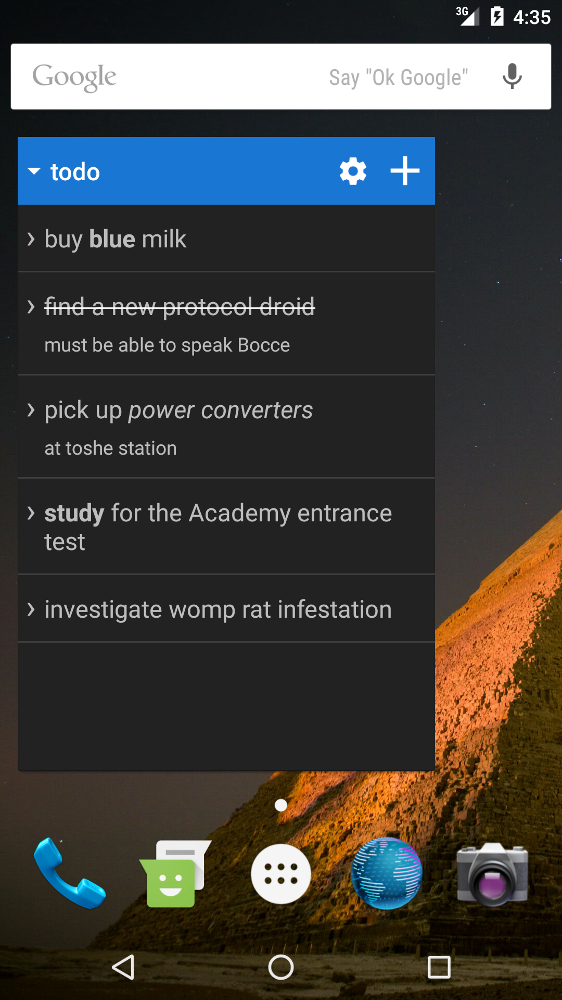
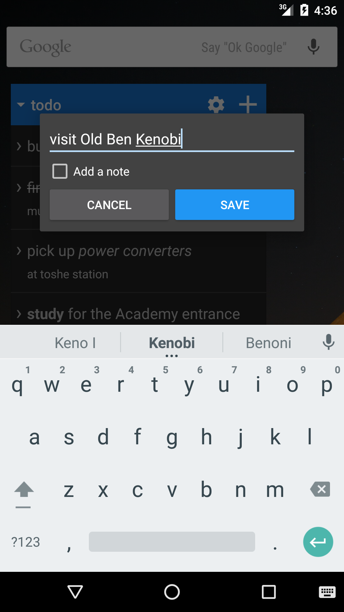
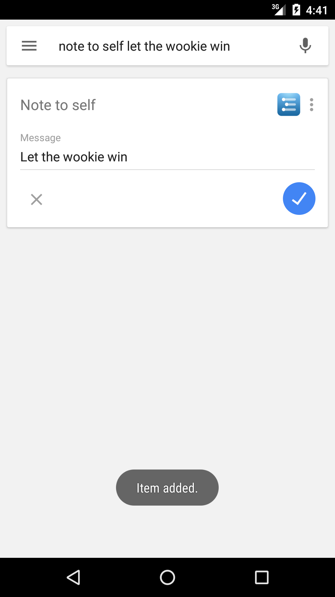
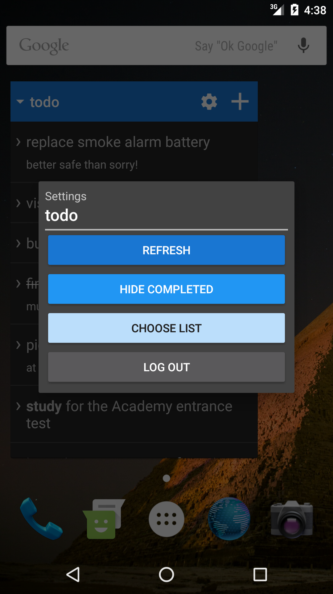

# WorkflowyList
A Workflowy to-do / note-taking list widget for Android. Includes a nice Workflowy Java client. 

[Click here](https://play.google.com/store/apps/details?id=com.rmnoon.workflowylist) to 
download from the Play Store.

## Features
* Quickly create, edit, delete, complete, and uncomplete list items and item notes.
* Offline sync.
* Choose a different list in each widget.
* Show / hide completed items.
* Voice recognition on the "Make a note" and "Not to self" voice intents.
* Pretty list formatting (bold, italic, etc).
* Material Design theme.

## Screenshots

